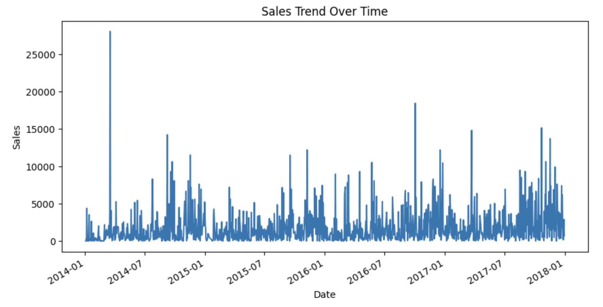
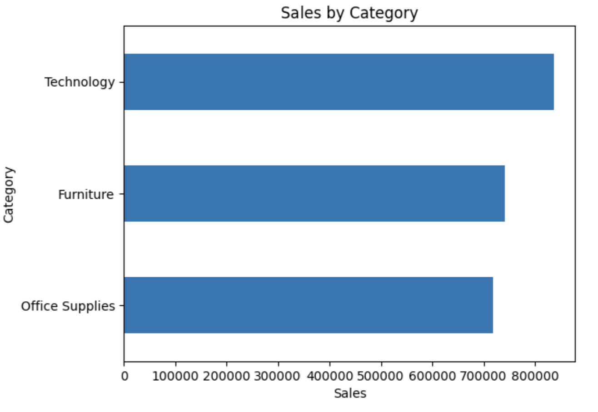
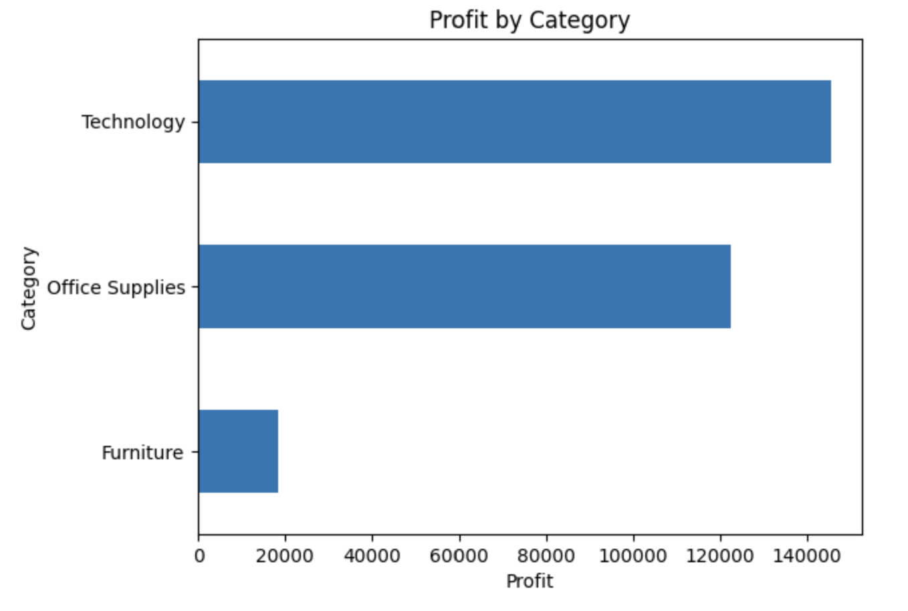
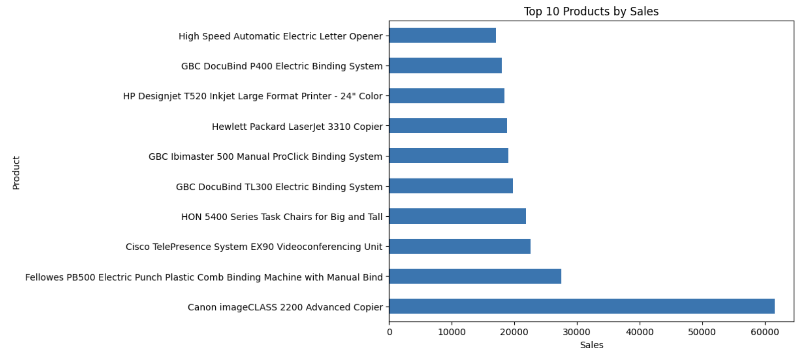
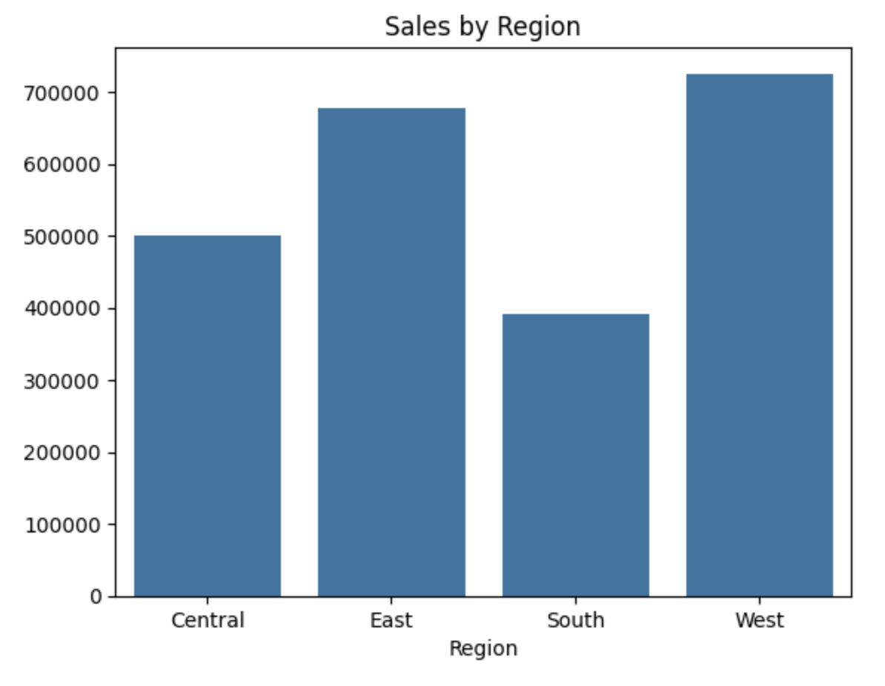
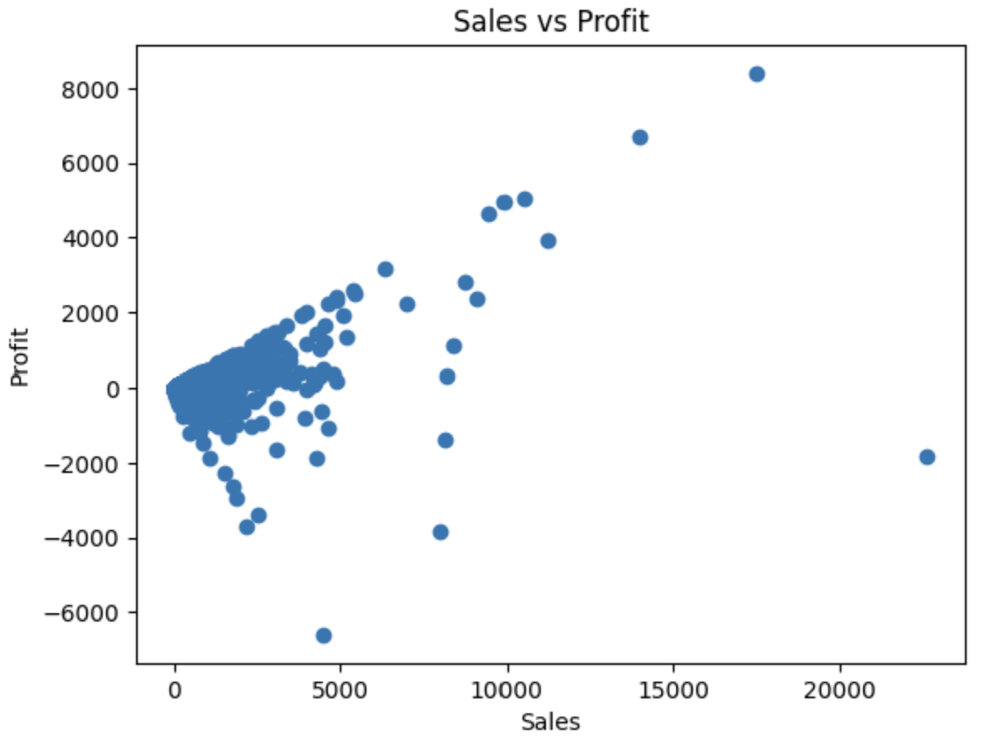
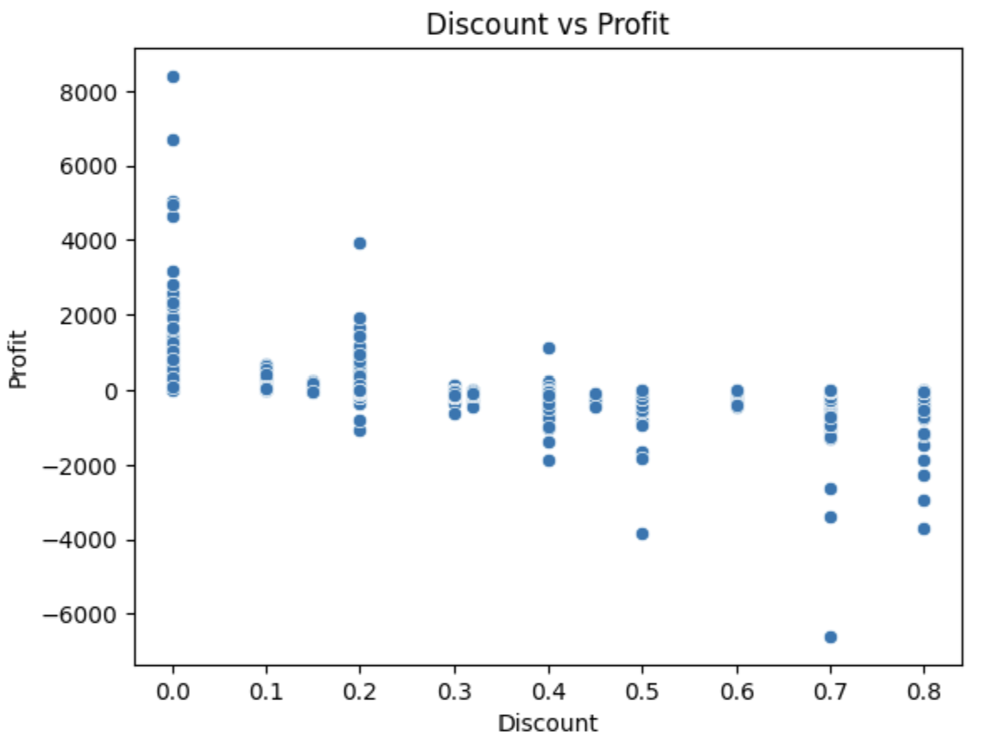
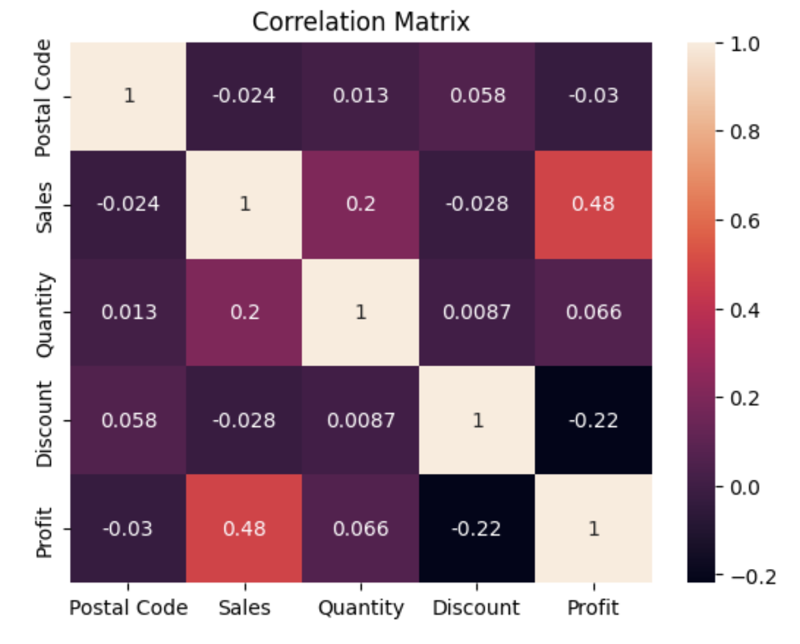

# Sales Performance & Customer Insights Analysis

## Project Overview

- This project presents an end to end analysis of retail sales data to uncover key business insights related to revenue, profitability, customer behavior, and regional performance.
- The analysis is performed using Python in a Jupyter Notebook, supported by visualizations that highlight trends, relationships, and performance drivers.

## Objectives

- Analyze sales performance over time.
- Identify top performing products and categories.
- Evaluate regional and customer segment contributions.  
- Understand the impact of discounting on profitability.
- Generate actionable business recommendations.

## Tools & Technologies

- Python  
- Pandas  
- NumPy  
- Matplotlib  
- Seaborn  
- Jupyter Notebook  

## Key Analysis

### Sales Trend Analysis

- Sales fluctuate over time with noticeable peaks. 
- Indicates seasonal demand and high value transactions.  

### Category wise Sales

- Technology generates the highest sales.  
- Furniture and Office Supplies contribute significantly. 

### Profit by Category

- Technology leads in profitability.  
- Furniture shows lower profit margins.  

### Top 10 Products

- A small number of products dominate sales.  
- Revenue is highly concentrated.  

### Regional Sales Analysis

- West region performs best.  
- South region underperforms.  

### Sales vs Profit

- High sales do not always lead to high profit.  
- Some transactions result in losses.  

### Discount vs Profit

- Higher discounts reduce profitability.  
- Strong negative relationship observed.  

### Correlation Matrix

- Sales and Profit show moderate positive correlation.  
- Discount negatively impacts profit.  
- Quantity has limited influence.

## Key Insights

- Sales growth does not guarantee profitability.  
- Discounting is a major factor affecting profit margins.  
- A few products and transactions drive most revenue.  
- Significant variation exists across regions and customer segments. 

## Business Recommendations

- Optimize discount strategies to avoid loss making sales.  
- Focus on high margin products.
- Reevaluate pricing for low profit items. 
- Expand operations in high performing regions. 
- Adopt data driven decision making.  

## Conclusion

- The project highlights key drivers of sales and profit, showing that pricing and discount strategies play a critical role in business performance.
- Insights from this analysis can support better decision making and improved profitability.
